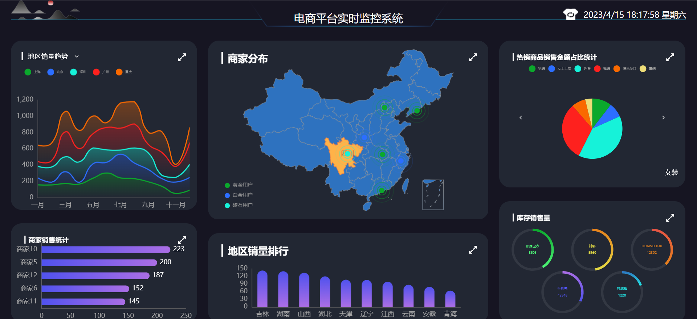

# 电商平台数据可视化实时监控系统 vision

这是一个同时将商家分布、地区排行、销量金额占比等多个电商平台数据可视化并实时监控的系统，该系统还实现了主体切换多端联动和图表放大效果。

## 技术栈

前端：

- vue2
- vue-router
- vuex
- echart
- axios

后端服务器：

- koa2
- websocket

## 项目使用说明

```
npm install

//开启服务器
node koa2_server/app.js

//启动项目
npm run serve
```

## 项目演示



